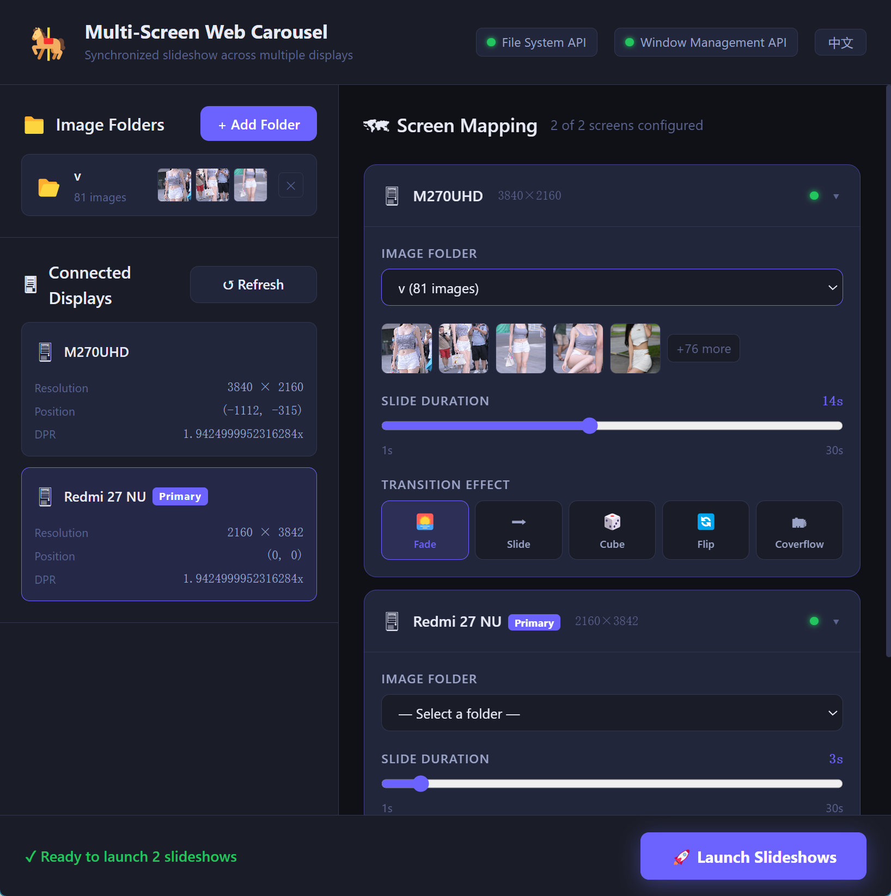

# Multi-Screen Web Carousel

A cross-platform desktop application for multi-screen photo carousels, featuring highly customizable, fullscreen slideshows. Built with Electron, React, and Vite.

## Overview

## Features

- **Multi-Screen Support**: Automatically detect multiple connected displays.
- **Folder Mapping**: Map specific local image folders to individual screens.
- **Customizable Slideshows**: Smooth image carousels powered by Swiper.
- **i18n Support**: Multilingual support built with i18next (English, Chinese).
- **Cross-Platform**: Packaged with Electron Builder for Windows (NSIS/Portable) and macOS.

## Tech Stack

- [React](https://react.dev/)
- [Vite](https://vitejs.dev/)
- [Electron](https://www.electronjs.org/)
- [Swiper](https://swiperjs.com/)
- [React Router](https://reactrouter.com/)

## Getting Started

### Prerequisites

- Node.js
- npm

### Installation & Run

1. **Install dependencies**:
   ``bash
   npm install
   ``

2. **Start Dev Mode**:
   ``bash
   npm run electron:dev
   ``

3. **Build Application**:
   ``bash
   npm run electron:build
   ``
   *(Check package.json for specific macOS/Windows scripts. Output goes to the
elease/ directory)*

## License

MIT License
